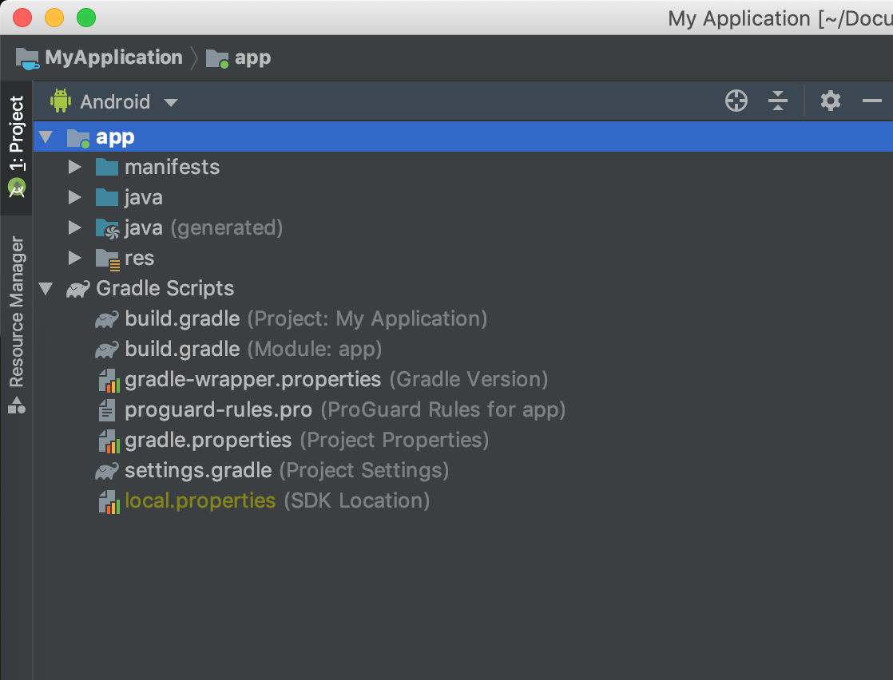
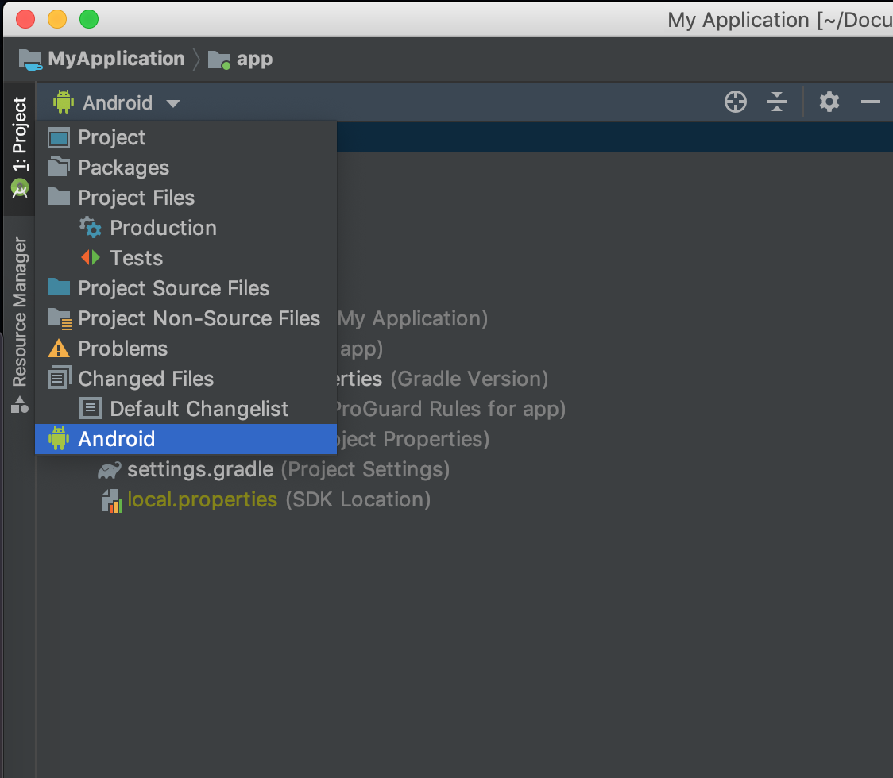
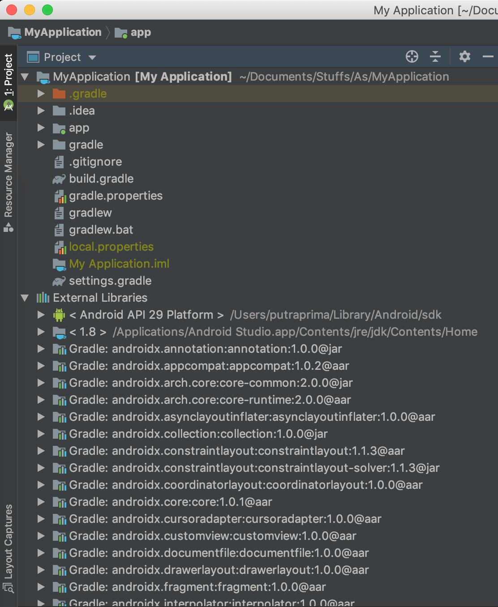
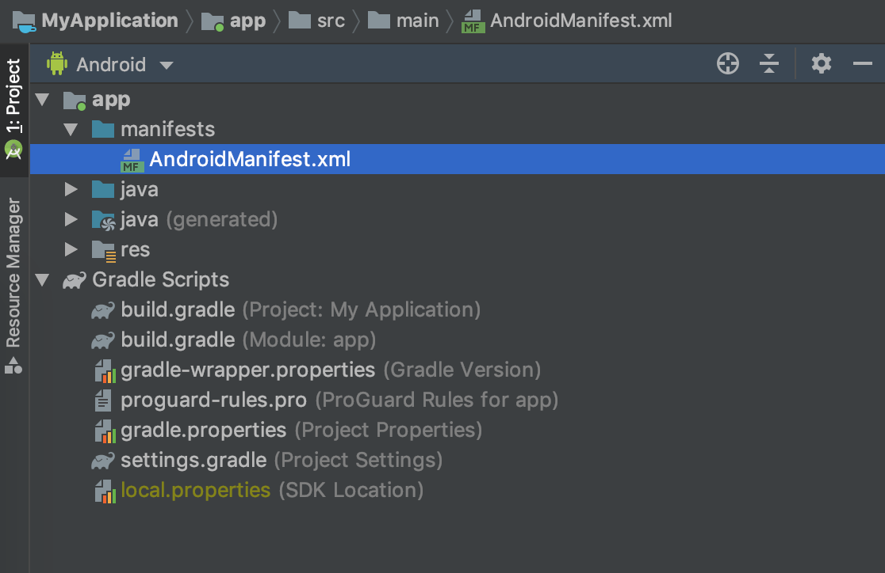
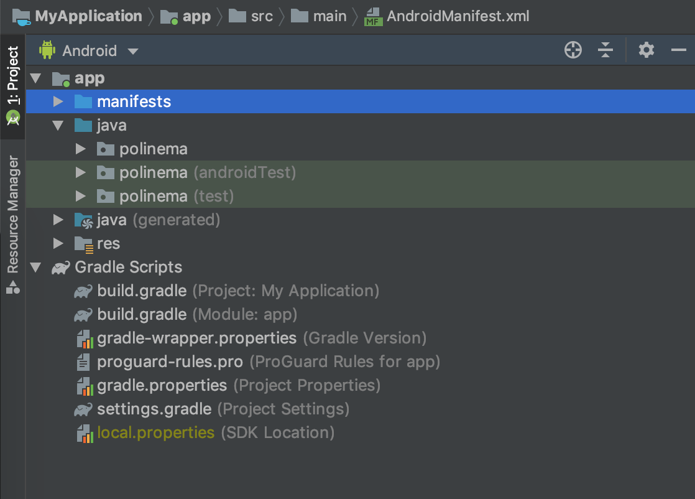

# Struktur Folder Project Android

Pada sub bab ini anda akan mempelajari mengenai struktur folder pada sebuah project android. Berikut ini struktur folder default kode program android pada android studio.


Perthatikan sebuah dropdown di atas folder tree jika pada gambar sebelumnya digunakan "view" project android banyak view lain yang dapat digunakan daftar "view" dapat anda lihat dengan melakukan klik pada dropdown tersebut.



Berikut ini tampilan file tree jika view diganti ke "Project"



Karena view project yang paling umum digunakan adalah "android" kembalikanlah view kembali ke "android" sehingga file tree anda kembali pada gambar pertama.

## Manifest

Pada folder manifest terdapat file yang berisi informasi mengenai permission, fitur dan activity/fragment yang digunakan.



Berikut ini isi dari file manifest pada sebuah template "Hello World"

```xml
<?xml version="1.0" encoding="utf-8"?>
<manifest xmlns:android="http://schemas.android.com/apk/res/android"
    package="polinema.ac.id.myapplication">

    <application
        android:allowBackup="true"
        android:icon="@mipmap/ic_launcher"
        android:label="@string/app_name"
        android:roundIcon="@mipmap/ic_launcher_round"
        android:supportsRtl="true"
        android:theme="@style/AppTheme">
        <activity android:name=".MainActivity">
            <intent-filter>
                <action android:name="android.intent.action.MAIN" />

                <category android:name="android.intent.category.LAUNCHER" />
            </intent-filter>
        </activity>
    </application>

</manifest>
```

Pada file ini dapat anda lihat bahwa terdapat beberapa informasi penting mengenai aplikasi yang dibuat mulai dari :

```xml
<manifest xmlns:android="http://schemas.android.com/apk/res/android"
    package="polinema.ac.id.myapplication">
```

Potongan kode manifest di atas menunjukkan bahwa package name yang digunakan adalah "polinema.ac.id.myapplication" impplikasinya adalah semua kode program pada folder java harus menggunakan nama package ini.

Potongan kode selanjutnya adalah :

```xml
    <application
        android:allowBackup="true"
        android:icon="@mipmap/ic_launcher"
        android:label="@string/app_name"
        android:roundIcon="@mipmap/ic_launcher_round"
        android:supportsRtl="true"
        android:theme="@style/AppTheme">
```

Pada kode xml ini di setting nama aplikasi, icon launcher, support rtl, dan tema aplikasi

Selanjutnya pada tag `activity` berisi informasi mengenai activity yang dimiliki oleh aplikasi

```xml
        <activity android:name=".MainActivity">
            <intent-filter>
                <action android:name="android.intent.action.MAIN" />

                <category android:name="android.intent.category.LAUNCHER" />
            </intent-filter>
        </activity>
```

Perhatikan pada tag `intent-filter` terdapat tag child `category` dengan properties `android.intent.category.LAUNCHER` ini menandakan bahwa activity pada tag ini merupakan activity yang **pertama** kali dibuka

## Java

Isi dari folder java dapat dilihat pada gambar dibawah ini :



Perhatikan terdapat tiga folder dengan nama yang sama sesuai dengan package name pada file manifest, dimana pada manifest package name nya adalah `polinema.ac.id.myapplication` maka pada folder java terdapat folder dengan nama yang sesuai dengan potongan pertama pada package name yaitu `polinema`

## Java(Generated)

## Res

## Gradle scripts
