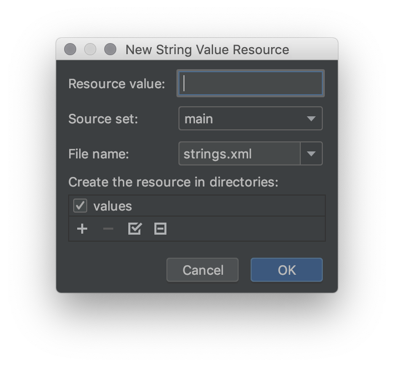
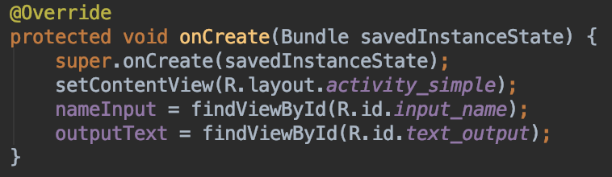

# Activity Sederhana

Pada praktikum sebelumnya anda telah mempelajari bagaimana daur hidup aplikasi
Android. Pada Activity terdapat dua buah file, yaitu `.java` dan `.xml`. Untuk
menghubungkannya anda dapat mengikuti langkah-langkah berikut untuk
mempelajarinya.

## Praktikum

- Pada project **AndroidLifecycle** tambahkan Activity (Empty Activity), beri
 nama `SimpleActivity`.

- Buka layout `activity_simple.xml`, ubah ke mode text kemudian ganti dengan code berikut:

  ```xml
  <?xml version="1.0" encoding="utf-8"?>
  <LinearLayout xmlns:android="http://schemas.android.com/apk/res/android"
      xmlns:tools="http://schemas.android.com/tools"
      android:layout_width="match_parent"
      android:layout_height="match_parent"
      android:layout_margin="10dp"
      android:orientation="vertical"
      tools:context=".SimpleActivity">

      <EditText
          android:id="@+id/input_name"
          android:hint="@string/hint_name"
          android:layout_width="match_parent"
          android:layout_height="wrap_content"
          />

      <Button
          android:id="@+id/button_submit"
          android:text="@string/submit"
          android:layout_width="match_parent"
          android:layout_height="wrap_content"
          android:onClick="handleSubmit"
          />

      <TextView
          android:id="@+id/text_output"
          android:textSize="24sp"
          android:layout_width="match_parent"
          android:layout_height="wrap_content"
          />

  </LinearLayout>
  ```

- Anda dapat melihat hasil akhir perubahan desain dengan menggunakan toolbar
 preview yang ada di sebelah kanan Android Studio.

- Terdapat 3 buah komponen yang digunakan pada layout tersebut, `EditText`,
 `Button` dan `TextView`.

- Layout pada Android menggunakan struktur xml. Setiap komponen mempunyai
 atribut-atribut dengan format key dan value. Atribut `android:id` digunakan
 untuk memberikan identitas pada suatu komponen Android.

- Jika anda perhatikan maka akan ada 3 buah indikator merah yang menunjukkan
 adanya error pada layout.

- Pindahkan cursor anda pada baris yang memuat kode `@string/hint_name` kemudian
 tekan tombol shortcut `Alt + Enter`. Kemudian pilih menu **Create string value
 resource 'hint_name'** sehingga muncul dialog seperti pada gambar di bawah.

  

- Masukkan nilai `Masukkan nama anda!`

- Ulangi langkah tersebut untuk nilai `@string/submit` dan isi nilai dengan
 `Submit`.

 > **Catatan**: Dengan menggunakan pendekatan ini, memudahkan localization pada
 > aplikasi Android.

- Pada baris atribut `android:onClick="handleSubmit"` tekan tombol `Alt + Enter`
 dan pilih **Create 'handleSubmit(View view)' in 'SimpleActivity'**. Android
 Studio akan menambahkan secara otomatis method pada file `SimpleActivity`.
 Proses ini digunakan untuk menambahkan logika pada Activity ketika tombol
 ditekan.

- Buka file `SimpleActivity.java` dan pahami struktur kodenya.
- Tambahkan dua buah atribut untuk mendeklarasikan `EditText` dan `TextView`
 sehingga menjadi berikut:

  ```java
  public class SimpleActivity extends AppCompatActivity {

    // Mendeklarasikan atribut dengan nama nameInput dengan tipe EditText
    private EditText nameInput;
    // Mendeklarasikan atribut dengan nama outputText dengan tipe TextView
    private TextView outputText;

    // ....
    // rest of code here...

  }
  ```

- Untuk menghubungkan atribut dengan desain layout xml, diperlukan proses bind
 dengan menggunakan method `findViewById(R.id.komponen_id)`. Tambahkan kode
 pada method onCreate() sehingga menjadi kode berikut.

 

- Tambahkan kode berikut pada method `handleSubmit(View view)` untuk menampilkan
 nilai nama dari `EditText` yang ditampilkan ke `TextView` ketika `Button` ditekan.

  ```java
  public void handleSubmit(View view) {
    String name = nameInput.getText().toString();
    outputText.setText("Hello " + name);
  }
  ```

- Tambahkan semua perubahan ke dalam repository dengan git. Kemudian commit
    dan push ke repository GitHub anda.
