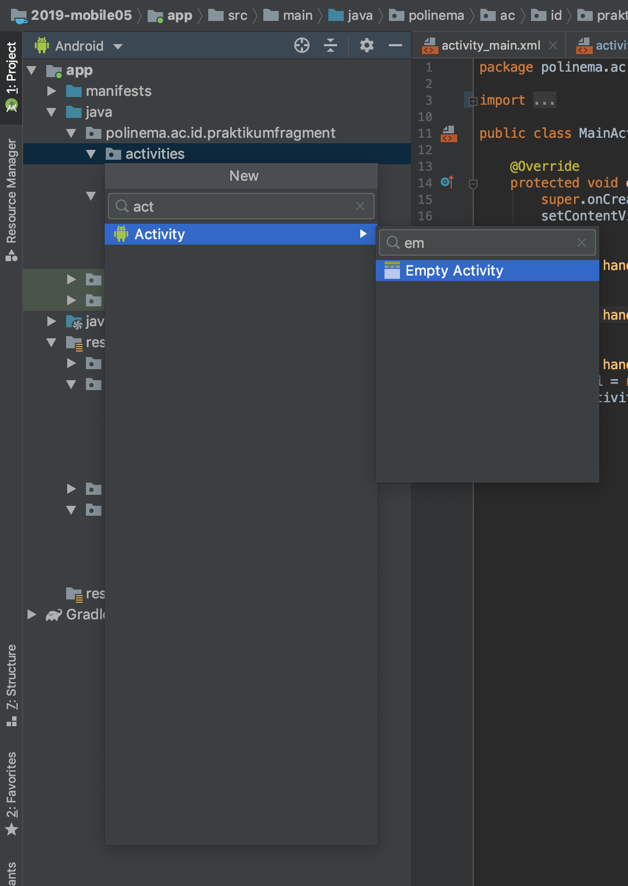
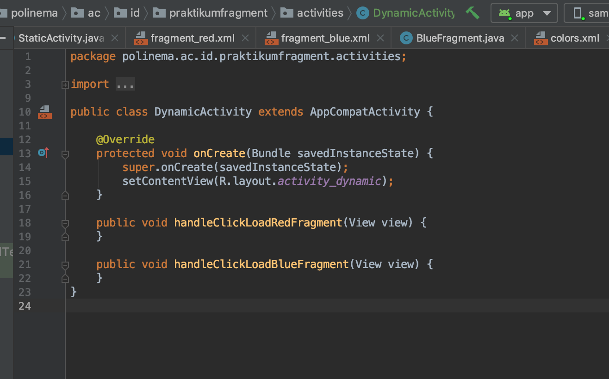
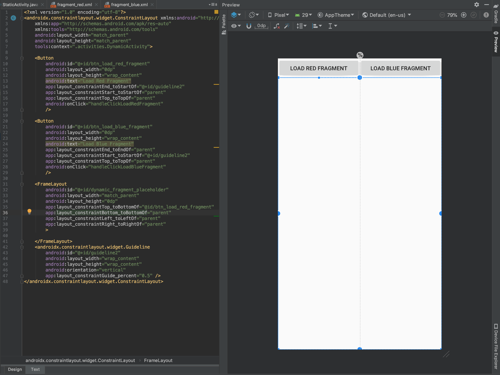

# Dynamic Fragment

Dynamic fragment adalah fragment yang dipasang ke sebuah activity dengan cara meng-embed (memasukkannya) pada saat run time, kelebihan dari penggunaan dynamic fragment adalah kebebasan dalam menentukan fragment mana yang di load pada saat run-time(aplikasi sedang berjalan) sehingga fragment yang di tampilkan menjadi dinamis.

## Langkah Percobaan

### Tambah Activity DynamicActivity

- Tambahkan sebuah empty activity pada package activities dengan nama `DynamicActivity`
  

  

### Modifikasi MainActivity

- Modifikasi handler dynamic fragment menggunakan `Intent` sehingga kode program tersebut dapat memindahkan activity dari main activity ke dynamic

### Modifikasi layout xml activity_dynamic.xml

- Modifikasi layout dari `activity_dynamic.xml` dengan memberikan dua buah tombol dengan spesifikasi sebagai berikut :

| No  | id                     | text               | onClick                      |
| --- | ---------------------- | ------------------ | ---------------------------- |
| 1   | btn_load_red_fragment  | Load Red Fragment  | handlerClickLoadRedFragment  |
| 2   | btn_load_blue_fragment | Load Blue Fragment | handlerClickLoadBlueFragment |

Berikut ini tampilan class DynamicActivity.java jika proses pembuatan tombol dan handler dilakukan dengan benar :



- Tambahkan juga sebuah frame layout dengan id `dynamic_fragment_placeholder` sehingga layout pada xml `activity_dynamic.xml` akan berubah menjadi seperti berikut ini :

  

### Modifikasi DynamicActivity.java

- Tambahkan Kode program berikut pada handler red buton untuk me load red fragment pada saat run time

```java
        FragmentTransaction fragmentTransaction = getSupportFragmentManager().beginTransaction();
        fragmentTransaction.replace(R.id.dynamic_fragment_placeholder,new RedFragment());
        fragmentTransaction.commit();

```

## TUGAS

- Lengkapi proses untuk load blue fragment secara dynamic pada saat run time
- Pelajari lebih lanjut mengenai fungsi fungsi pada Class FragmentTransaction terutama mengenai fungsi add, remove, dan replace
