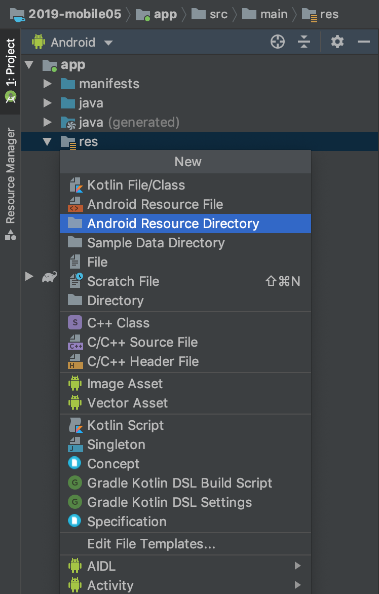
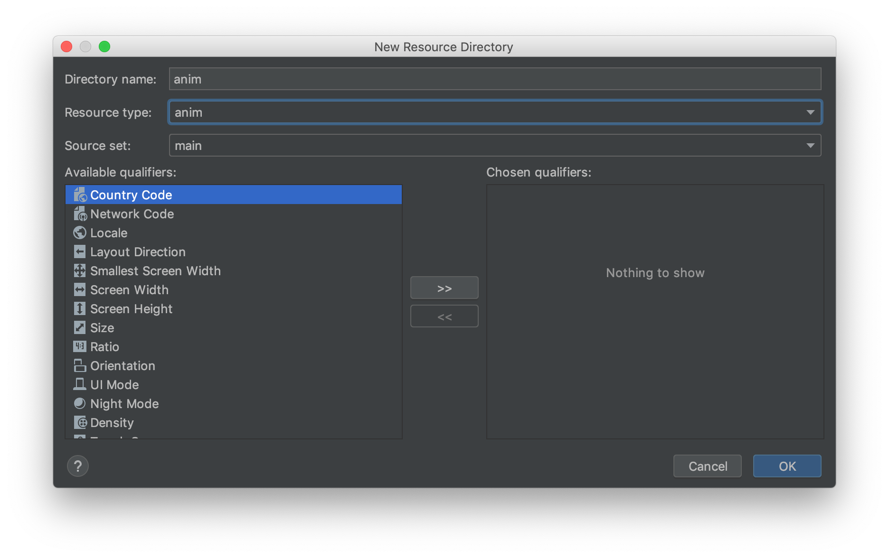
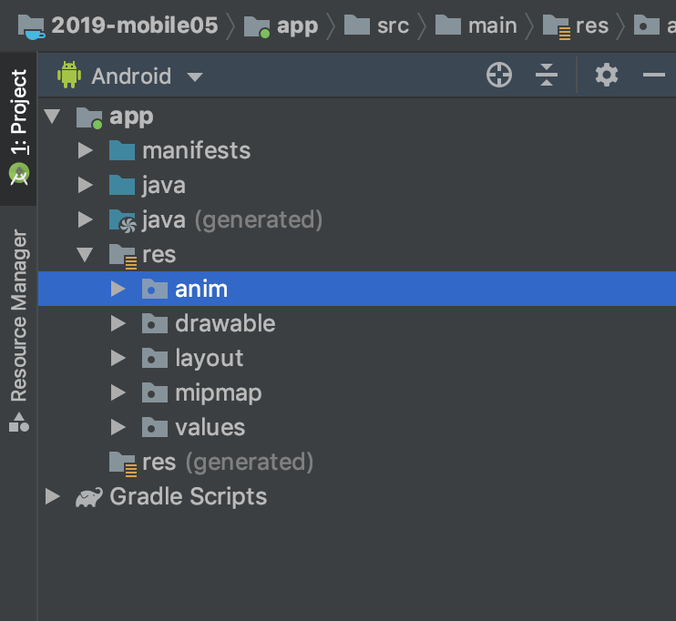
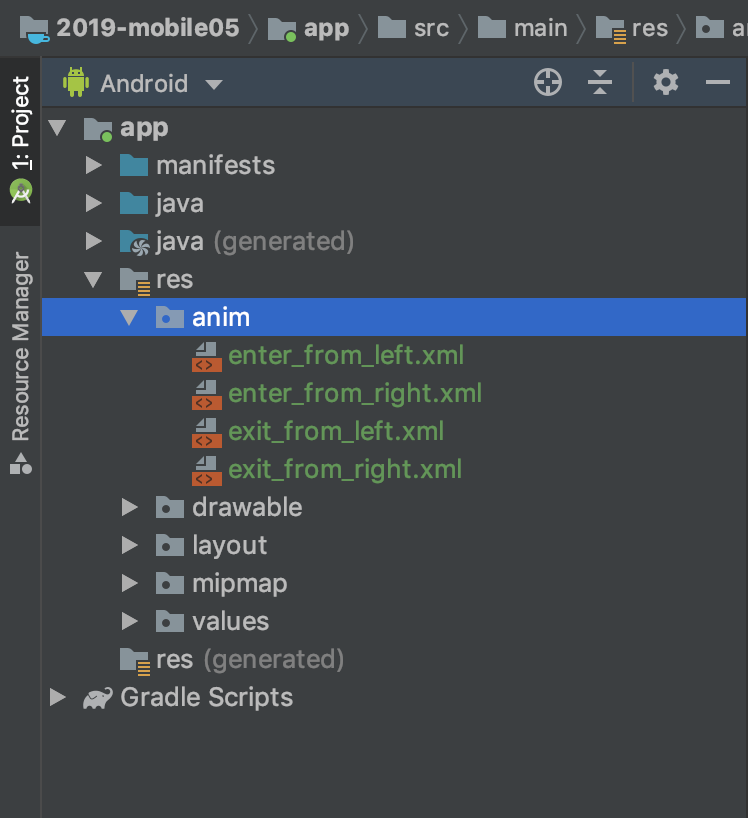

# Transition Pada Fragment

Fragment dapat diberi efek animasi transisi, efek ini di jalankan ketika fragment di load dan di implementasikan pada fragment yang di load dan yang di replace.

## Langkah Praktikum

### Default Transition

- Ubah lah isi fungsi handler pada dynamic activity dengan menambahkan pemanggilan ke method `fragmentTransaction.setTransition(FragmentTransaction.TRANSIT_FRAGMENT_FADE);`

```java
    public void handleClickLoadRedFragment(View view) {
        FragmentTransaction fragmentTransaction = getSupportFragmentManager().beginTransaction();
        fragmentTransaction.setTransition(FragmentTransaction.TRANSIT_FRAGMENT_OPEN);
        fragmentTransaction.replace(R.id.dynamic_fragment_placeholder,new RedFragment(),"RED_FRAGMENT");
        fragmentTransaction.addToBackStack(null);
        fragmentTransaction.commit();
    }

    public void handleClickLoadBlueFragment(View view) {
        FragmentTransaction fragmentTransaction = getSupportFragmentManager().beginTransaction();
        fragmentTransaction.setTransition(FragmentTransaction.TRANSIT_FRAGMENT_OPEN);
        fragmentTransaction.replace(R.id.dynamic_fragment_placeholder,new BlueFragment(),"BLUE_FRAGMENT");
        fragmentTransaction.addToBackStack(null);
        fragmentTransaction.commit();
    }
```

- Jalankan kembali aplikasi dan perhatikan apa yang berubah.

### Custom Transition

- Kita juga bisa membuat sebuah fragment transition custom dengan menambahkan animation nya ke folder `anim` pada folder `res` di project android.

- Buatlah folder res baru untuk menyimpan file animasi yang akan dibuat.

  
  

- Jika proses pembuatan folder `anim` berhasil dilaksanakan dengan benar file tree project anda akan seperti ini.

  

- Tambahkan 4 buah file xml dengan nama

  - `enter_from_left.xml`
  - `enter_from_right.xml`
  - `exit_from_left.xml`
  - `exit_from_right.xml`

  

- isikan kode program berikut pada file `enter_from_left.xml`

```xml
<?xml version="1.0" encoding="utf-8"?>
<set xmlns:android="http://schemas.android.com/apk/res/android" >

    <objectAnimator
        xmlns:android="http://schemas.android.com/apk/res/android"
        android:duration="500"
        android:propertyName="x"
        android:valueFrom="1000"
        android:valueTo="0"
        android:valueType="floatType" />

</set>
```

- isikan kode program berikut pada file `enter_from_right.xml`

```xml
<?xml version="1.0" encoding="utf-8"?>
<set xmlns:android="http://schemas.android.com/apk/res/android" >

    <objectAnimator
        xmlns:android="http://schemas.android.com/apk/res/android"
        android:duration="500"
        android:propertyName="x"
        android:valueFrom="0"
        android:valueTo="-1000"
        android:valueType="floatType" />

</set>
```

- isikan kode program berikut pada file `exit_from_left.xml`

```xml
<?xml version="1.0" encoding="utf-8"?>
<set xmlns:android="http://schemas.android.com/apk/res/android"
    >

    <objectAnimator
        android:duration="500"
        android:propertyName="x"
        android:valueFrom="0"
        android:valueTo="1000"
        android:valueType="floatType" />
</set>
```

- isikan kode program berikut pada file `exit_from_right.xml`

```xml
<set xmlns:android="http://schemas.android.com/apk/res/android"  >
    <objectAnimator
        android:propertyName="x"
        android:duration="500"
        android:valueFrom="-1000"
        android:valueTo="0"
        android:valueType="floatType" />
</set>
```

- ubah kode program handler pada `DynamicActivity.java` menjadi seperti dibawah ini.

```java
    public void handleClickLoadRedFragment(View view) {
        FragmentTransaction fragmentTransaction = getSupportFragmentManager().beginTransaction();
        fragmentTransaction.setCustomAnimations(R.anim.enter_from_left,R.anim.exit_from_left,R.anim.enter_from_left,R.anim.exit_from_right);
        fragmentTransaction.replace(R.id.dynamic_fragment_placeholder,new RedFragment(),"RED_FRAGMENT");
        fragmentTransaction.addToBackStack(null);
        fragmentTransaction.commit();
    }
```
