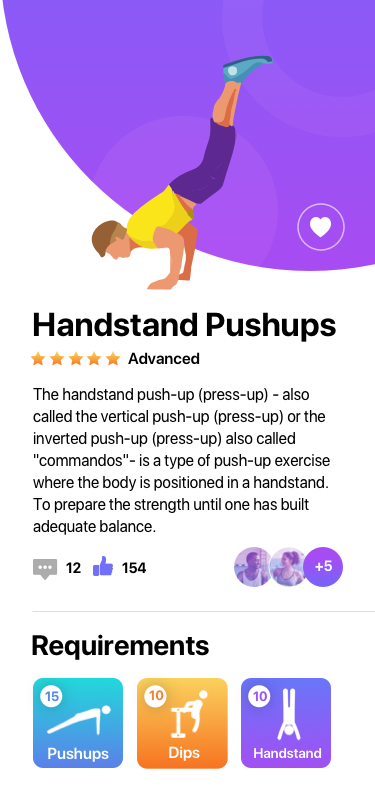

# Tugas Praktikum

- Buatlah aplikasi android dengan tema fitness, gunakanlah layout dibawah ini :
  
- pada layout diatas terdapat tiga buah button, pushups, dips dan handstand implementasikanlah layout ini menggunakan fragment dimana ketika salah satu tombol di klik area lain di atas tulisan `Requirements` berubah dengan kontent yang baru dari fragment yang berbeda.
- sudah disediakan starter code yang berisi asset gambar yang diperlukan untuk membuat aplikasi ini silahkan manfaatkan asset tersebut dan buatlah layout androidnya sendiri.
- Lengkapilah aplikasi anda dengan backstack dan animation pada fragment nya
