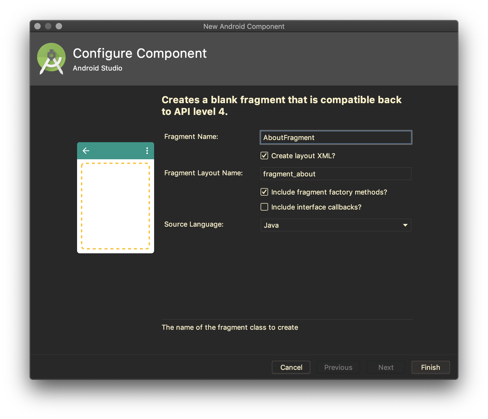
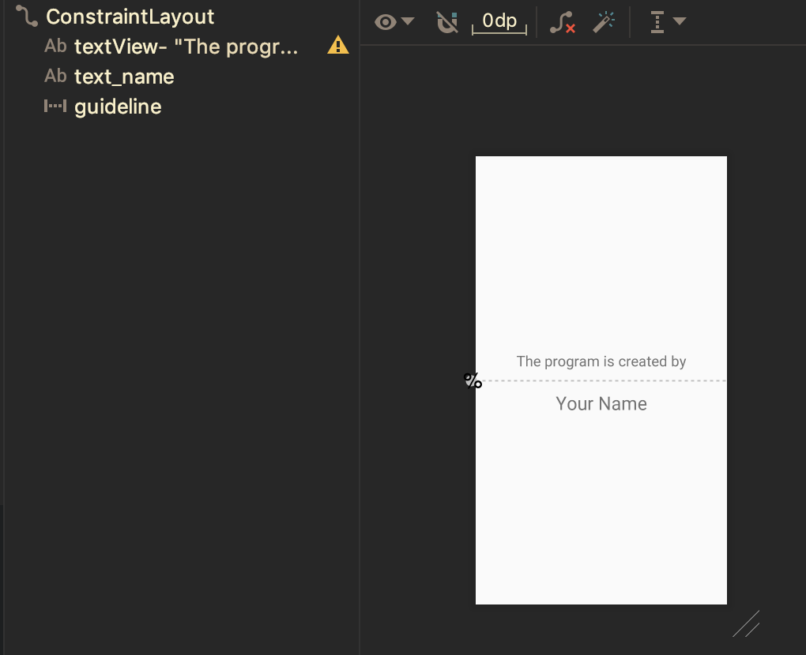

# Fragment dengan Argumen

Sebuah Fragment dapat berkomunikasi dengan menerima argumen atau parameter.
Pola yang umum digunakan yaitu dengan menggunakan method static `newInstance`
untuk membuat Fragment dengan argumen. Hal ini dikarenakan sebuah Fragment
sebaiknya hanya mempunya contructor tanpa adanya argumen. Sebagai contoh:

```java
public class DemoFragment extends Fragment {
    // Creates a new fragment given an int and title
    // DemoFragment.newInstance(5, "Hello");
    public static DemoFragment newInstance(int someInt, String someTitle) {
        DemoFragment fragmentDemo = new DemoFragment();
        Bundle args = new Bundle();
        args.putInt("someInt", someInt);
        args.putString("someTitle", someTitle);
        fragmentDemo.setArguments(args);
        return fragmentDemo;
    }
}
```

Fragment yang telah diatur argumen untuk kemudian nilai argumen akan dibaca pada
saat `onCreate`. Contoh pengaksesan data dapat dilihat sebagai berikut:

```java
public class DemoFragment extends Fragment {
   @Override
   public void onCreate(Bundle savedInstanceState) {
       super.onCreate(savedInstanceState);
       // Get back arguments
       int SomeInt = getArguments().getInt("someInt", 0);
       String someTitle = getArguments().getString("someTitle", "");
   }
}
```

# Percobaan

- Fork repository [starter code yang telah disediakan](https://github.com/polinema-mobile/2019-mobile06)
- Clone repository kemudian buka dengan Android Studio
- Pada percobaan ini akan dibuat aplikasi ideal body weight calculator
- Untuk memudahkan organisasi kode, tambahkan 2 package yaitu `fragments` dan `util`
- Buat sebuah Fragment baru dengan template Blank, beri nama `AboutFragment`.
 Perhatikan gambar berikut untuk pengaturan yang dibutuhkan.

 

- Bukalah layout `fragment_about.xml`, buat layout seperti pada gambar berikut.

  

- Bukalah file `AboutFragment.java`, perhatikan tanda **TODO** pada kode
 template yang telah digenerate oleh Android Studio.
- Pada AboutFragment, akan dikirimkan data nama pembuat aplikasi. Untuk
 memudahkan proses ini, ubahlah konstanta parameter argumen sehingga menjadi:

  ```java
  private static final String ARG_NAME = "name";
  ```

- Modifikasi tipe data parameter yang disimpan ke atribut, sehingga kodenya
 menjadi seperti berikut:

  ```java
  private String name;
  ```

- Perhatikan pada method `newInstance`, sesuaikan parameter serta proses
 pengaturan nilai pada Bundle sehingga menjadi seperti berikut:

  ```java
  public static AboutFragment newInstance(String name) {
      AboutFragment fragment = new AboutFragment();
      Bundle args = new Bundle();
      args.putString(ARG_NAME, name);
      fragment.setArguments(args);
      return fragment;
  }
  ```

- Proses pembacaan data yang dikirimkan dilakukan pada `onCreate`, modifikasi
 program menjadi seperti berikut.

  ```java
  @Override
  public void onCreate(@Nullable Bundle savedInstanceState) {
      super.onCreate(savedInstanceState);
      if (getArguments() != null) {
          name = getArguments().getString(ARG_NAME);
      }
  }
  ```

- Pengaturan layout pada Fragment dilakukan pada `onCreateView`, modifikasi kode
 menjadi seperti berikut.

  ```java
  @Override
  public View onCreateView(LayoutInflater inflater, ViewGroup container,
                           Bundle savedInstanceState) {
      // Inflate the layout for this fragment
      View view = inflater.inflate(R.layout.fragment_about, container, false);
      TextView nameText = view.findViewById(R.id.text_name);
      nameText.setText(name);
      return view;
  }
  ```

> **Catatan**: Pada Fragment untuk melakukan bind layout, tidak bisa dilakukan
> secara langsung. Tetapi melalui `View`, sehingga kode yg digunakan `view.findViewById()`

- Pada langkah selanjutnya, bukalah file `activity_main.xml`. Pada tahapan ini,
 akan dilakukan pengaturan layout untuk meletakkan Fragment secara dinamis.

- AboutFragment yang telah dibuat, akan ditampilkan ketika menu **About**
 ditekan.

- Tambahkan atribut `AboutFragment aboutFragment` pada class `MainActivity`

  ```java
  private AboutFragment aboutFragment;
  ```

- Instansiasi `aboutFragment` pada method `onCreate`.

  ```java
  aboutFragment = AboutFragment.newInstance("Dian Hanifudin Subhi");
  ```

  > **Catatan**: Tulislah nama anda pada kode di atas.

- Pada method `onOptionsItemSelected` tambahkan, kode untuk mereplace Fragment
 secara dinamis.

  ```java
  if (item.getItemId() == R.id.menu_about) {
      getSupportFragmentManager().beginTransaction()
              .replace(R.id.fragment_container, aboutFragment)
              .addToBackStack(null)
              .commit();
  }
  ```

- Kompilasi program dan jalankan aplikasi. Tekan menu **About** dan amati apa
 yang terjadi.

- Commit perubahan yang telah anda lakukan, dan push ke repository anda!
