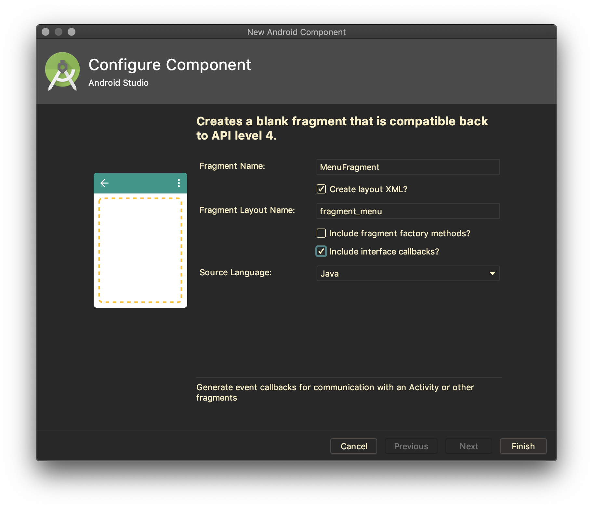
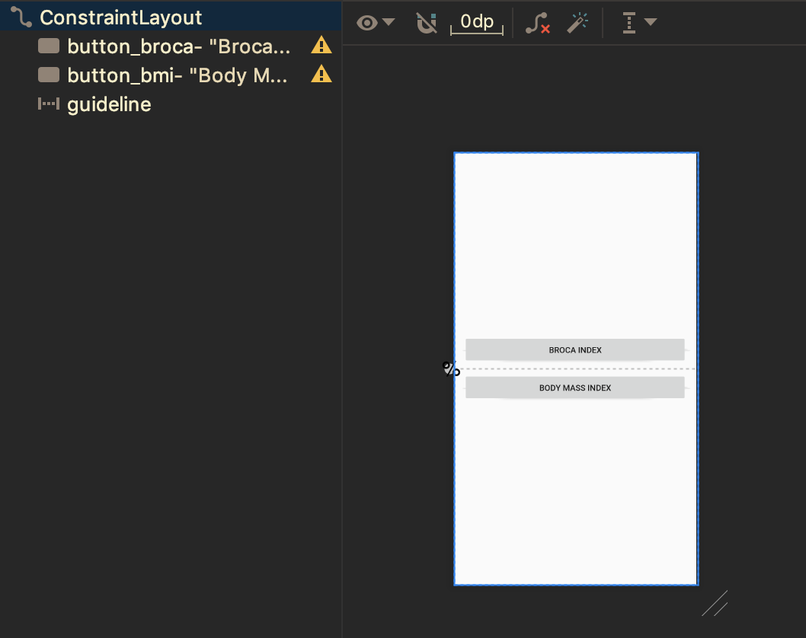
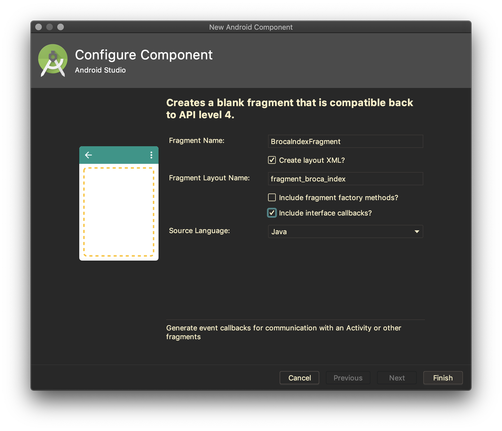

# Fragment Listener

Jika sebuah fragment membutuhkan komunikasi *event* dengan activity, fragment
sebaiknya mendefinisikan interface dan menyatakan activity harus
mengimplementasikan interface ini.

# Percobaan

- Tambahkan fragment baru pada package `fragments`, dan beri nama
 `MenuFragment`. Perhatikan gambar berikut untuk pengaturan pembuatan Fragment.

  

- Buatlah layout seperti pada gambar berikut.

  

- Bukalah file `MenuFragment.java`, perhatikan kode template yang digenerate
 oleh Android Studio.

- Fragment yang dibuat, membutuhkan dua interaksi pada tombol **Broca Index**
 dan **Body Mass Index**. Sehingga dibutuhkan dua method pada interface yang
 perlu didefinisikan.

- Scroll pada bagian bawah class `MenuFragment`, modifikasi interface sehingga
 menjadi seperti berikut.

  ```java
  public interface OnFragmentInteractionListener {
      void onBrocaIndexButtonClicked();
      void onBodyMassIndexButtonClicked();
  }
  ```

- Perhatikan pada class `MenuFragment`, hapuslah method `onButtonPressed`.
 Petunjuk: carilah bagian kode yang berwarna merah.

- Untuk langkah selanjutnya perlu dilakukan register listener ke dalam event UI
 tombol. Perhatikan pada method `onCreateView`, inflate layout dan simpan ke
 dalam `View view`.

  ```java
  @Override
  public View onCreateView(LayoutInflater inflater, ViewGroup container,
                           Bundle savedInstanceState) {
      // Inflate the layout for this fragment
      View view = inflater.inflate(R.layout.fragment_menu, container, false);

      // sisipkan register event click nanti di sini.

      return view;
  }
  ```

- Bind layout dengan `findViewById` untuk tombol yang dibutuhkan pada method
 `onCreateView`.

  ```java
  Button brocaButton = view.findViewById(R.id.button_broca);
  Button bmiButton = view.findViewById(R.id.button_bmi);
  ```

- Register event click pada tombol `brocaButton`

  ```java
  brocaButton.setOnClickListener(new View.OnClickListener() {
      @Override
      public void onClick(View view) {
          if (mListener != null) {
              mListener.onBrocaIndexButtonClicked();
          }
      }
  });
  ```

- Lakukan juga untuk tombol `bmiButton`

  ```java
  bmiButton.setOnClickListener(new View.OnClickListener() {
      @Override
      public void onClick(View view) {
          if (mListener != null) {
              mListener.onBodyMassIndexButtonClicked();
          }
      }
  });
  ```

- Buka kembali `MainActivity.java`, implementasikan interface
 `MenuFragment.OnFragmentInteractionListener`. Jika anda melihat garis bawah
 warna merah, tekan shortcut `Alt + Enter` untuk mengimplementasikan method yang
 dibutuhkan.

  ```java
  public class MainActivity extends AppCompatActivity implements
    MenuFragment.OnFragmentInteractionListener {

  }
  ```

- Deklarasikan atribut `MenuFragment menuFragment` pada class `MainActivity`.
- Instansiasi `menuFragment` pada method `onCreate`

  ```java
  menuFragment = new MenuFragment();
  ```

- tambahkan kode berikut ini pada akhir pernyataan dalam method `onCreate`

  ```java
  getSupportFragmentManager().beginTransaction()
          .replace(R.id.fragment_container, menuFragment)
          .commit();
  ```

- Perhatikan pada method `onBrocaIndexButtonClicked`, pada bagian ini akan
 diletakkan logic untuk mengganti fragment. Untuk menghitung berat badan ideal,
 digunakan Broca formula.
 [Referensi](http://www.bmi-calculator.net/ideal-weight-calculator/broca-formula/)

- Untuk memudahkan perhitungan Broca Index, buatlah class `BrocaIndex` pada
 package `util`.

  ```java
  public class BrocaIndex {

      public static final int MALE = 0;
      public static final int FEMALE = 1;

      private int gender;
      private int height;
      private float index;

      public BrocaIndex(int gender, int height) {
          this.gender = gender;
          this.height = height;
          this.index = calculate();
      }

      public float getIndex() {
          return index;
      }

      private float calculate() {
          switch (gender) {
              case MALE: return (height - 100) - ((height - 100) * 0.1f);
              case FEMALE: return (height - 100) + ((height - 100) * 0.15f);
              default: return 0f;
          }
      }
  }
  ```

- Buatlah `BrocaIndexFragment`, perhatikan pengaturan pada gambar berikut.

  

- Buatlah layout pada `fragment_broca_index.xml` sesuai dengan gambar berikut.

  

- Bukalah file `BrocaIndexFragment.java`, perhatikan pada bagian bawah file.
 Modifikasi interface menjadi berikut.

  ```java
  public interface OnFragmentInteractionListener {
      void onCalculateBrocaIndexClicked(float index);
  }
  ```

- Hapuslah method `onButtonPressed` yang tidak digunakan.
- Perhatikan pada method `onCreateView`, modifikasi kode menjadi berikut.

  ```java
  @Override
  public View onCreateView(LayoutInflater inflater, ViewGroup container,
                           Bundle savedInstanceState) {
      // Inflate the layout for this fragment
      View view = inflater.inflate(R.layout.fragment_broca_index, container, false);
      final RadioGroup genderGroup = view.findViewById(R.id.group_gender);
      final EditText heightText  = view.findViewById(R.id.input_height);

      Button calculateButton = view.findViewById(R.id.button_calculate);
      calculateButton.setOnClickListener(new View.OnClickListener() {
          @Override
          public void onClick(View view) {
              if (mListener != null) {
                  String heightString = heightText.getText().toString();
                  int checkedId = genderGroup.getCheckedRadioButtonId();
                  if ((checkedId != -1) && !TextUtils.isEmpty(heightString)) {
                      int height = Integer.parseInt(heightString);
                      int gender = (checkedId == R.id.radio_male) ? BrocaIndex.MALE : BrocaIndex.FEMALE;
                      BrocaIndex brocaIndex = new BrocaIndex(gender, height);
                      mListener.onCalculateBrocaIndexClicked(brocaIndex.getIndex());
                  } else {
                      Toast.makeText(getActivity(), "Please select gender and input your height", Toast.LENGTH_SHORT).show();
                  }
              }
          }
      });
      return view;
  }
  ```

- Buka kembali file `MainActivity.java`, tambahkan implementasi interface
 `BrocaIndexFragment.OnFragmentInteractionListener` sehingga menjadi seperti
 berikut.

  ```java
  public class MainActivity extends AppCompatActivity implements
        MenuFragment.OnFragmentInteractionListener,
        BrocaIndexFragment.OnFragmentInteractionListener {

  }
  ```

- Implement method dengan shortcut `Alt + Enter`.
- Deklarasikan atribut `BrocaIndexFragment brocaIndexFragment`.

  ```java
  private BrocaIndexFragment brocaIndexFragment;
  ```

- Instansiasi `brocaIndexFragment` pada method `onCreate`.

  ```java
  brocaIndexFragment = new BrocaIndexFragment();
  ```

- Lengkapi kode pada method `onBrocaIndexButtonClicked` menjadi seperti berikut.

  ```java
  @Override
  public void onBrocaIndexButtonClicked() {
      getSupportFragmentManager().beginTransaction()
              .replace(R.id.fragment_container, brocaIndexFragment)
              .commit();
  }
  ```
- Jalankan aplikasi, dan amati apa yang terjadi. Pada tahap ini, aplikasi sudah
 dapat melakukan perhitungan berat ideal tetapi hasilnya masih belum bisa
 ditampilkan.

- Commit perubahan yang anda lakukan, dan push ke repository anda.
