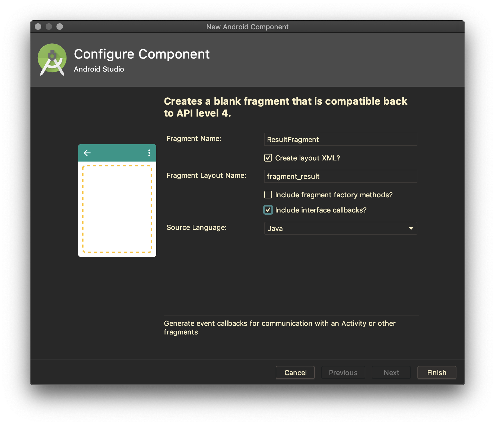
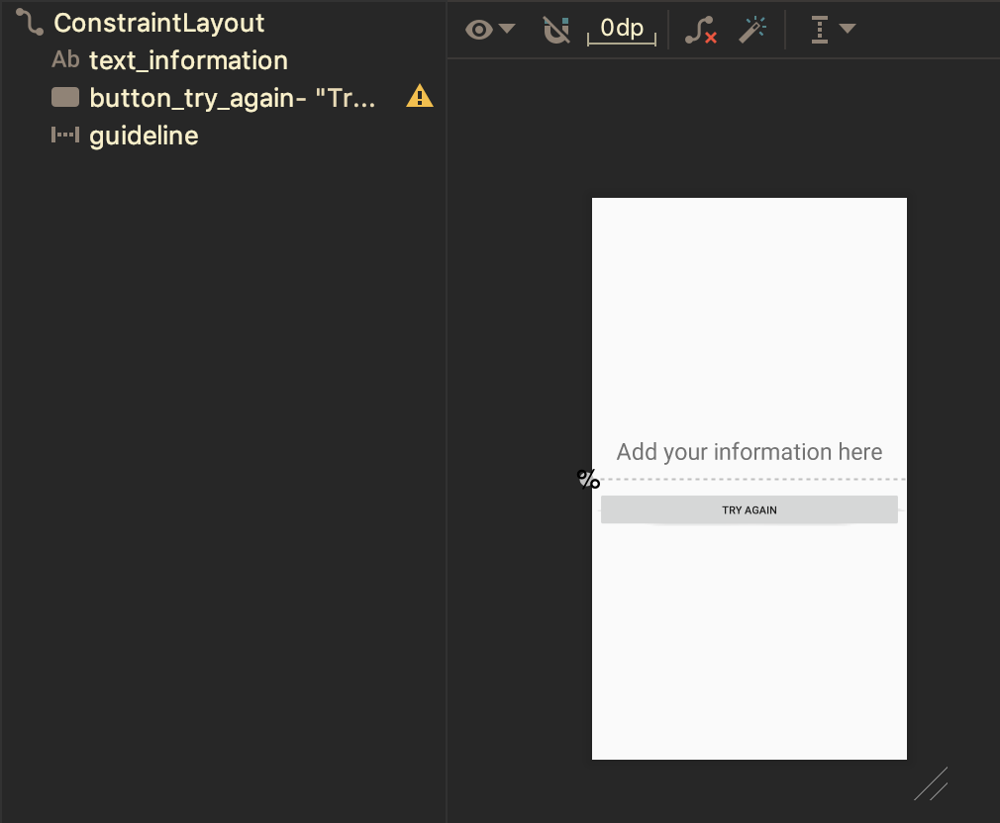

# Fragment Method

Jika sebuah activity menginginkan sebuah fragment melakukan aksi setelah
inisialisasi, cara termudah melakukannya dengan cara activity memanggil method
pada fragment. Sebagai contoh, pada sebuah fragment terdapat method:

```java
public class DemoFragment extends Fragment {
  public void doSomething(String param) {
      // do something in fragment
  }
}
```

Pada activity, panggil method fragment yang telah didefinisikan.

```java
public class MainActivity extends AppCompatActivity {
    @Override
    public void onCreate(Bundle savedInstanceState) {
        super.onCreate(savedInstanceState);
        DemoFragment fragmentDemo = (DemoFragment)
            getSupportFragmentManager().findFragmentById(R.id.fragmentDemo);
        fragmentDemo.doSomething("some param");
    }
}
```

## Percobaan

- Tambahkan fragment baru pada package `fragments`, beri nama `ResultFragment`.
 Perhatikan gambar berikut, untuk pengaturan yang dibutuhkan.

  

- Bukalah `fragment_result.xml`, buat layout seperti gambar berikut.

  

- Update interface pada `ResultFragment.java`, menjadi seperti berikut.

  ```java
  public interface OnFragmentInteractionListener {
      void onTryAgainButtonClicked(String tag);
  }
  ```

- Hapus method `onButtonPressed` yang tidak dibutuhkan.
- Tambahkan atribut `String information` pada class `ResultFragment`
- Buat method `setInformation` dengan akses public. Method ini yang digunakan
 untuk berkomunikasi dengan fragment.

  ```java
  public void setInformation(String information) {
      this.information = information;
  }
  ```

- Modifikasi method `onCreateView` menjadi kode berikut.

  ```java
  @Override
  public View onCreateView(LayoutInflater inflater, ViewGroup container,
                           Bundle savedInstanceState) {
      // Inflate the layout for this fragment
      View view = inflater.inflate(R.layout.fragment_result, container, false);
      TextView informationText = view.findViewById(R.id.text_information);
      informationText.setText(information);
      Button tryAgainButton = view.findViewById(R.id.button_try_again);
      tryAgainButton.setOnClickListener(new View.OnClickListener() {
          @Override
          public void onClick(View view) {
              if (mListener != null) {
                  mListener.onTryAgainButtonClicked("BrocaIndex");
              }
          }
      });
      return  view;
  }
  ```

- Bukalah kembali `MainActivity.java`, tambahkan interface
 `ResultFragment.OnFragmentInteractionListener` sehingga kode akhir definisi
 class `MainActivity` menjadi seperti berikut.

  ```java
  public class MainActivity extends AppCompatActivity implements
          MenuFragment.OnFragmentInteractionListener,
          BrocaIndexFragment.OnFragmentInteractionListener,
          ResultFragment.OnFragmentInteractionListener {

  }
  ```

- Generate implementasi method yang dibutuhkan, dengan shortcut `Alt + Enter`
- Tambahkan atribut `ResultFragment resultFragment`.

  ```java
  private ResultFragment resultFragment;
  ```

- Kemudian instansiasi `resultFragment` pada method `onCreate`, sehingga menjadi
 seperti berikut.

  ```java
  resultFragment = new ResultFragment();
  ```

- Lengkapi method `onCalculateBrocaIndexClicked` untuk menampilkan hasil
 perhitungan berat ideal ke dalam `ResultFragment`.

  ```java
  @Override
  public void onCalculateBrocaIndexClicked(float index) {
      resultFragment.setInformation(String.format("Your ideal weight is %.2f kg", index));
      getSupportFragmentManager().beginTransaction()
              .replace(R.id.fragment_container, resultFragment)
              .commit();
  }
  ```

- Lengkapi method `onTryAgainButtonClicked` sehingga kembali pada fragment
 Broca.


  ```java
  @Override
  public void onTryAgainButtonClicked(String tag) {
      getSupportFragmentManager().beginTransaction()
              .replace(R.id.fragment_container, brocaIndexFragment)
              .commit();
  }
  ```

- Jalankan aplikasi, dan perhatikan apa yang terjadi.

- Commit perubahan, dan push ke repository anda masing-masing.
