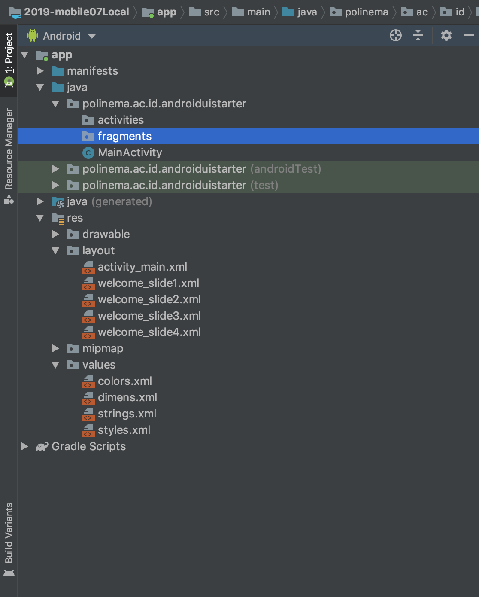
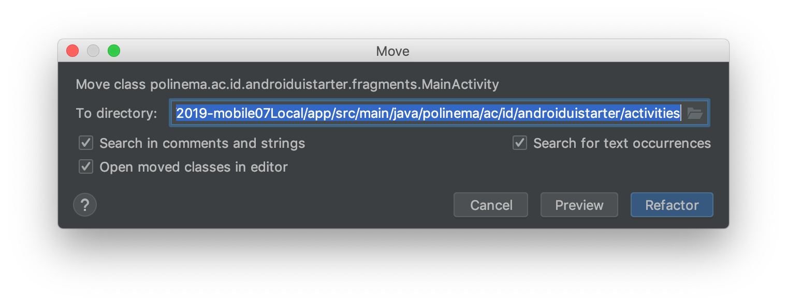
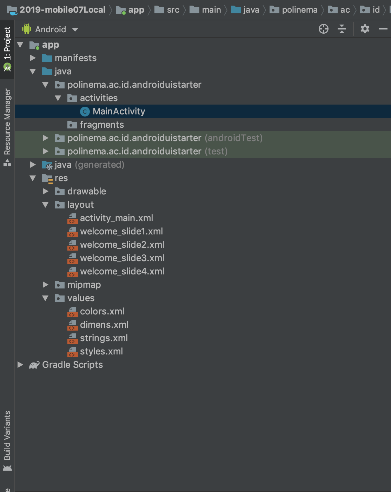
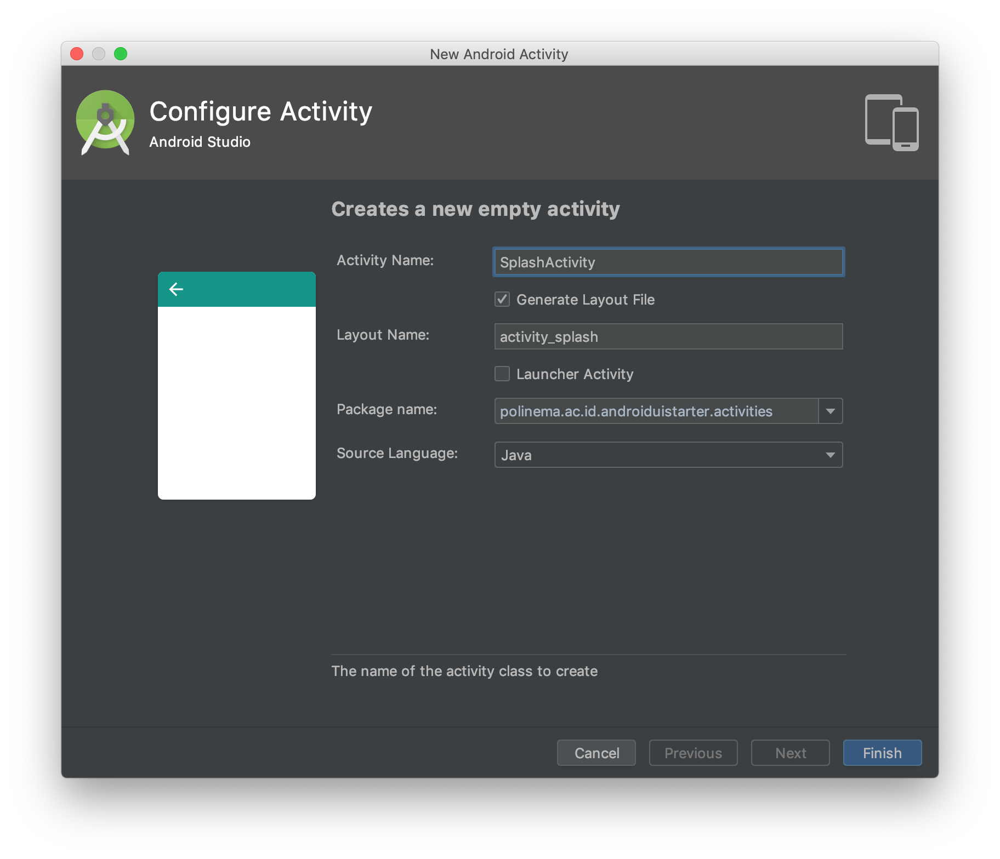
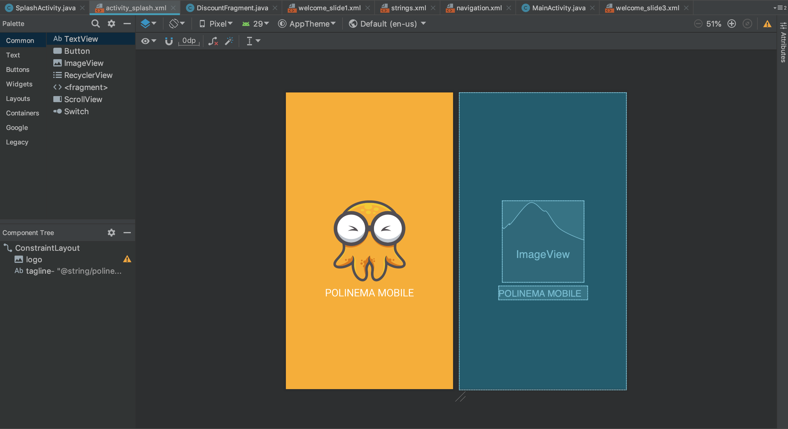

# Splash Screen

Splash screen adalah layar awal yang dibuka sebelum aplikasi di jalankan. Berikut ini beberapa diskusi menarik mengenai splash screen yang patut anda baca sebelum membuat splash screen.

1. [The (Complete) Android Splash Screen Guide](https://android.jlelse.eu/the-complete-android-splash-screen-guide-c7db82bce565)
2. [Splash Screen The Right Way](https://www.bignerdranch.com/blog/splash-screens-the-right-way/)
3. [Splash Screen Are Evil, Don't use them](https://cyrilmottier.com/2012/05/03/splash-screens-are-evil-dont-use-them/)

## Praktikum

- Buatlah dua buah package baru di project anda berilah nama berikut :

  - `activities` berisi semua activity pada project ini.
  - `fragments` berisi semua fragments pada project ini.
    

- Pindahkan file `MainActivity.java` ke package `activities`
  
  
- Buat Activity baru dengan nama `SplashActivity` pada package `activity`
  
- Ubah tampilan pada file `activity_splash.xml` sehingga menjadi seperti dibawah ini
  
  > Note gambar dan warna dapat dibuat sendiri atau pilih dari yang ada di folder res
- Buka `AndroidManifest.xml` dan ganti `SplashActivity` menjadi activity launcher.
  

```xml
<?xml version="1.0" encoding="utf-8"?>
<manifest xmlns:android="http://schemas.android.com/apk/res/android"
    package="polinema.ac.id.androiduistarter">

    <application
        android:allowBackup="true"
        android:icon="@mipmap/ic_launcher"
        android:label="@string/app_name"
        android:roundIcon="@mipmap/ic_launcher_round"
        android:supportsRtl="true"
        android:theme="@style/AppTheme">
        <activity android:name=".activities.SplashActivity">
            <intent-filter>
                <action android:name="android.intent.action.MAIN" />

                <category android:name="android.intent.category.LAUNCHER" />
            </intent-filter>
        </activity>
        <activity android:name=".activities.MainActivity">
        </activity>
    </application>

</manifest>
```

- Tambahkan Kode Program splash screen pada `SplashActivity.java`

```java
    @Override
    protected void onCreate(Bundle savedInstanceState) {
        super.onCreate(savedInstanceState);
        setContentView(R.layout.activity_splash);

        new Handler().postDelayed(new Runnable() {
            @Override
            public void run() {
                startActivity(new Intent(SplashActivity.this,WelcomeActivity.class));
                finish();
            }
        },5000);
    }

```
