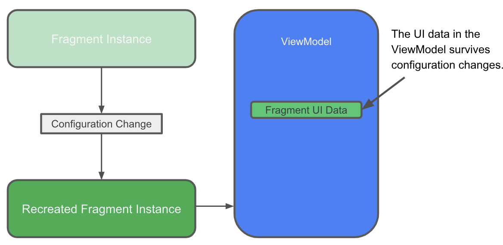

# Android Arsitektur

Android Arsitektur selalu berkembang setiap waktu. Rekomendasi terkini
dikompilasi dalam Android Jetpack. Android Jetpack berisi kumpulan library, alat
dan panduan untuk membantu para developer membuat aplikasi berkualitas tinggi
dengan mudah. Salah satu rekomendasi dalam Jetpack yaitu ViewModel.

Kelebihan menggunakan ViewModel, tidak diperlukan proses pengambilan ulang atau
kehilangan data pada UI Android. Sebelum dikenalkan ViewModel salah satu solusi
untuk menangani permasalahan ini dengan menyimpan data UI pada bundle ketika
masuk pause dan membaca ulang ketika aplikasi masuk ke resume. Sebagai ilustrasi
berkaitan tentang ViewModel, anda dapat melihat Gambar di bawah ini.

Pada ViewModel menyimpan data UI, ketika terjadi perubahan (pergantian
orientasi), maka data masih tersimpan. Dengan ini, maka developer tidak perlu
melakukan proses tulis dan baca data, ketika terjadi perubahan. Sehingga bisa
fokus untuk membuat aplikasi dengan lebih mudah.
